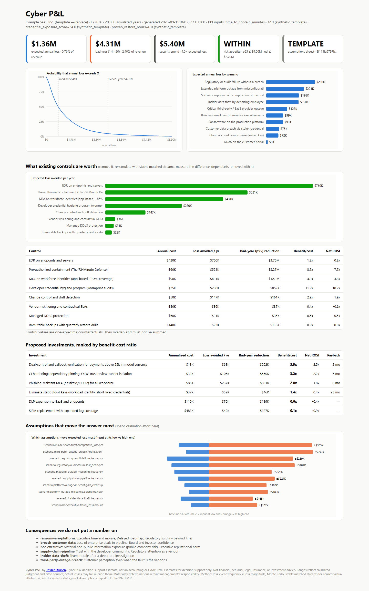

# Cyber P&L

**Open-source cyber risk quantification for CISO–CFO decisions.** Cyber P&L uses transparent, FAIR-style loss analysis and Monte Carlo simulation to translate cyber risk, control effectiveness, and security investments into financial decision support.

Created and maintained by **[Jessen Kurien](https://github.com/jessenkurien)**.

[](https://github.com/jessenkurien/cyber-pnl/actions/workflows/ci.yml)


> **Important:** The included company, measurements, costs, appetite, and results are fictional. They demonstrate the workflow; they are not benchmark findings or a forecast. Cyber P&L is not an accounting or GAAP profit-and-loss statement and is not financial, actuarial, legal, insurance, or investment advice.

> **Project status:** v0.1.0 public release candidate. The software and fictional demonstration are ready for evaluation. A real organization's model is not ready for executive use until its own evidence, accountable owners, model review, and required attestations pass `cyberpnl validate --operational`.

```text
$ cyberpnl statement
  Cyber P&L | Example SaaS Inc. (template — replace) | FY2026 | 20,000 simulated years
  ------------------------------------------------------------------------------
  Expected annual loss       $1.36M   (0.76% of revenue)
  Bad year (p95)             $4.31M   (2.40% of revenue)     p99 $7.89M
  Risk appetite (p95)        WITHIN   $4.31M vs limit $9.00M
  Risk appetite (eal)        WITHIN   $1.36M vs limit $2.70M
  Assumptions              TEMPLATE   missing current digest attestation from required role: CFO
```



## Why this exists

Boards ask two reasonable questions that heat maps cannot answer directly:

1. How much cyber risk are we carrying in money?
2. What decision changes if we spend another dollar on security?

Cyber P&L puts scenarios, assumptions, control effects, and proposed investments on one economic axis.

It does not make uncertainty disappear. It exposes the uncertainty, assigns each material input to an owner and source, and makes the decision logic reviewable.

## Who it is for

- **CISOs and security leaders:** Compare cyber-risk treatment and investment choices.
- **CFOs, risk committees, and boards:** Review financial ranges, decision ownership, and explicit model limits rather than a single unexplained number.
- **GRC, enterprise-risk, internal-audit, and security-assurance teams:** Govern evidence and risk appetite.
- **Practitioners and advisors:** Start with an inspectable model instead of a proprietary score.

It is not a substitute for actuarial analysis, a FAIR/Open FAIR certification, audited financial
reporting, legal advice, an insurance model, or management's materiality determination.

## What it does

- **Scenario modeling:** Models ten service-and-threat scenarios for a fictional $180M SaaS company.
- **Loss simulation:** Samples loss-event frequency and CFO-recognizable loss components using PERT, lognormal, or fixed inputs; recovery offsets are explicit and event loss can never fall below zero.
- **Annual-loss reporting:** Produces expected annual loss, annual-loss percentiles, a loss-exceedance curve, and scenario shares.
- **Existing-control valuation:** Removes a control and its declared dependents, then re-runs the model with stable, independently seeded input streams.
- **Replacement handling:** Prevents an upgrade such as phishing-resistant MFA from stacking on top of the control it replaces.
- **Investment economics:** Reports benefit-cost ratio (`loss avoided / annualized cost`) separately from net ROSI (`(loss avoided - annualized cost) / annualized cost`) and calculates payback from net annual benefit.
- **Risk-appetite enforcement:** Tests every configured limit in `model/appetite.yaml`, not merely the first one.
- **Operational evidence:** Converts time to contain, credential exposure, and restore time into control multipliers through named, monotonic KPI curves.
- **Decision artifacts:** Produces HTML, Markdown, and JSON statements plus an assumption register and endpoint-sensitivity tornado.
- **International formatting:** Uses the model's three-letter currency code, familiar symbols for widely used currencies, and an unambiguous code prefix for others.

The sample currently exposes **119 material inputs**, including scenario ranges, business values,
control costs, appetite limits, KPI values, curve parameters, and the stacking floor.

## Trust model

`cyberpnl validate` checks strict schemas, references, source IDs, owners, selectors, dependency cycles,
probability bounds, and other invariants. Misspelled YAML fields are rejected rather than ignored.

`cyberpnl attest` creates a named assertion over the model's SHA-256 digest. Editing the model makes
that assertion stale. This is **tamper evidence, not identity authentication**: a YAML digest record is
not a cryptographic digital signature. Organizations that require authenticated approval should sign
the digest with their existing GPG, Sigstore, or document-approval workflow.

The repository ships with no fictional CFO/CISO attestations. Therefore:

```bash
cyberpnl validate                 # passes: structurally valid illustrative template
cyberpnl verify                   # fails: deliberately unattested
cyberpnl validate --operational   # fails until real evidence, owners, status, and attestations exist
```

## Try it

```bash
git clone https://github.com/jessenkurien/cyber-pnl.git
cd cyber-pnl
python -m venv .venv
# Windows: .venv\Scripts\activate
# macOS/Linux: source .venv/bin/activate
python -m pip install -e ".[dev]"

cyberpnl validate
cyberpnl statement --out out
cyberpnl invest
cyberpnl explain ransomware-platform
cyberpnl register
```

Open `out/statement.html` in a browser. The default model is bundled with the installed package, so
the CLI also works outside the source directory.

Optional adapters can import evidence from compatible local JSON outputs; neither integration is
required to use Cyber P&L:

```bash
cyberpnl kpis import \
  --from-72md ../72-minute-defense/out \
  --from-wormprint ../wormprint/report.json
```

An empty, malformed, or oversized import fails loudly. A wormprint exposure score must be between 0
and 100. Treat imported evidence as untrusted until its provenance and scope have been reviewed.

## Model structure

| File | Decision content |
|---|---|
| `model/business.yaml` | Revenue, security spend, services, and revenue per hour |
| `model/scenarios.yaml` | Loss-event frequencies and component-level magnitudes |
| `model/controls.yaml` | Existing/proposed controls, dependencies, replacements, costs, and effects |
| `model/kpis.yaml` | Evidence value, source, owner, date, and evidence status |
| `model/appetite.yaml` | One or more board-approved thresholds |
| `model/sources.yaml` | Source catalog and model-risk settings |
| `model/register.yaml` | Required roles and current digest attestations |

## What leadership gets

| Leadership question | Model output |
|---|---|
| How much loss do we expect, and what could a bad year look like? | EAL, annual-loss percentiles, and exceedance curve |
| Are we inside appetite? | A separate pass/fail check for every approved limit |
| What does the EDR renewal contribute? | One-at-a-time counterfactual value, with dependents included |
| Which proposal should we fund first? | Benefit-cost ratio, net ROSI, payback, and p95 reduction |
| Where did the number come from? | Material-input register with source and owner |
| What deserves another calibration hour? | Endpoint sensitivity tornado |
| What did the model omit? | Explicit unpriced consequences and model-risk page |

## Method limits you should know

- Annual-loss percentiles describe the simulated loss distribution; they are **not confidence
  intervals for EAL**.
- Parameter uncertainty and annual event variability are sampled in one layer. The tool does not yet
  provide second-order uncertainty analysis.
- Scenario processes are independent, so correlated events can make the far tail too low.
- Control attribution is one-at-a-time and non-additive. Do not sum control values. Declared
  dependencies handle prerequisites; replacement semantics handle substitutes; Shapley attribution
  remains a roadmap item.
- KPI curves are transparent judgment functions, not fitted causal models.
- The sensitivity tornado is one-at-a-time endpoint analysis, not global sensitivity analysis.
- Public reports provide calibration context. Organization-specific ranges still require internal
  evidence and accountable review.

See [methodology](docs/methodology.md), [model risk](docs/model-risk.md),
[calibration guide](docs/calibration-guide.md), [CFO brief](docs/cfo-brief.md),
[GRC mapping](docs/grc/mapping.md), and [implementation guide](docs/implementation.md).

## Public references

- [Cyentia Institute, Information Risk Insights Study 2025](https://www.cyentia.com/iris/)
- [IBM X-Force, 2025 Cost of a Data Breach: AI Risks, Shadow AI, and Solutions](https://www.ibm.com/think/x-force/2025-cost-of-a-data-breach-navigating-ai)
- [FBI, 2025 IC3 Annual Report](https://www.ic3.gov/AnnualReport/Reports/2025_IC3Report.pdf)
- [Coveware, Q2 2026 ransomware report](https://coveware.com/2026/07/adverse-cyber-extortions-are-more-common-than-commonly-advised/)

The method is FAIR-style and belongs to the broader family of loss-event frequency × loss-magnitude
analysis. Open FAIR is a trademark of The Open Group. This project is not affiliated with, certified
by, or endorsed by The Open Group and does not claim conformance.

## International use

Set `currency` in `model/business.yaml` to an uppercase three-letter currency code such as `USD`,
`EUR`, `GBP`, `CAD`, `AUD`, `INR`, `SGD`, or `AED`. Cyber P&L does not perform currency conversion;
all monetary inputs in one model must use the declared currency consistently.

Regulatory mappings are navigation aids, not claims of compliance. The included US and European
references should be replaced or supplemented with the requirements and legal interpretation that
apply to the organization using the model.

## Attribution and citation

**Cyber P&L was created by Jessen Kurien.** If you use or adapt this project in a publication,
product, client engagement, training program, presentation, or research paper, please credit
**“Cyber P&L by Jessen Kurien”** and link to
[the original repository](https://github.com/jessenkurien/cyber-pnl).

For a formal software citation, use GitHub's **Cite this repository** control or the metadata in
[`CITATION.cff`](CITATION.cff). Redistribution remains governed by the MIT License, which requires
the copyright and permission notice to be retained in copies or substantial portions of the
software. The citation request above does not add a restriction beyond that license.

## License

MIT © 2026 [Jessen Kurien](https://github.com/jessenkurien). See [SECURITY.md](SECURITY.md) for private
reporting guidance.
